<div align="center">

# CrossPath

### Two trained retrieval models hide two more retrieval functions. Nobody scores them.

[](https://www.python.org/)
[](https://pytorch.org/)
[](LICENSE)
[](#5-verify-the-repository)
[](#3-results)
[](#1-what-this-is)

[**Idea**](#1-what-this-is) · [**Install**](#2-install) · [**Results**](#3-results) · [**Reproduce**](#4-reproduce) ·
[**Verify**](#5-verify-the-repository) · [**Demo system**](#6-a-running-demo-system) · [**Visuals**](#7-visualizations) · [**Cite**](#9-citation)

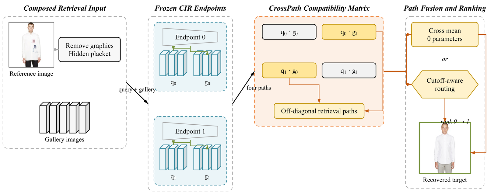

</div>

---

## 1. What this is

Take two composed-image-retrieval models that someone already finished training. Each one is really
two pieces: a **query composer** `C_i` that turns (reference image, modification text) into a query
vector, and a **gallery encoder** `V_i` that turns a catalogue photo into a gallery vector. Training
always optimises the pair together, so everyone keeps using them together.

But two endpoints give you **four** query–gallery pairings, not two:

|                | gallery `g₀`     | gallery `g₁`     |
| -------------- | ---------------- | ---------------- |
| **query `q₀`** | `S₀₀` model 0    | `S₀₁` **unused** |
| **query `q₁`** | `S₁₀` **unused** | `S₁₁` model 1    |

The diagonal is the two models you trained. The off-diagonal is two retrieval functions that no
training run ever produced — and that nobody scores. CrossPath scores them.

**What we find.** The off-diagonal is not noise. On FashionIQ the single strongest path in the whole
matrix is an off-diagonal one, and averaging the two cross paths beats the compute-matched diagonal
ensemble. This costs **zero parameters** and **zero encoder training** — the same four vectors are
already in memory.

**What we add on top.** Different recall cutoffs prefer different rankings, so a query-level router
picks one of 17 candidate orderings (1 baseline + 8 diagonal-branch + 8 cross-branch) by estimating
which candidates can cross the top-K boundary. It adds **0.526M parameters** and **4.48 ms/query**,
and falls back to the baseline ordering when the evidence is thin.

> [!IMPORTANT]
> The endpoints stay frozen throughout. Nothing in this repository fine-tunes an image or text encoder.

---

## 2. Install

```bash
git clone https://github.com/ChizkiyahuOhayon/CrossPath.git
cd CrossPath
python -m pip install -r requirements.txt     # numpy + torch is enough for the core
```

The core method (`weave_crosspath.py`, `weave_crosspath_gate.py`) needs only NumPy and PyTorch.
Exporting endpoint embeddings inherits the dependencies of whichever upstream endpoint you use.

---

## 3. Results

### FashionGen validation — 5,292 gallery items, 9,031 queries

| Method                             |      Params | R@1       | R@5       | R@10      |
| ---------------------------------- | ----------: | --------- | --------- | --------- |
| CLIP4CIR (MaxSim)                  |       0.25B | —         | 17.1      | 25.0      |
| SPRC (MaxSim)                      |        1.2B | —         | 42.7      | 53.0      |
| Qwen3-VL-8B (Joint)                |          8B | —         | 74.7      | 83.5      |
| ProCIR (paper)                     |        0.8B | —         | 75.0      | 85.3      |
| Strong reproduced base `E₀`        |        0.8B | 42.73     | 79.26     | 87.75     |
| CrossPath, matched only            | 2×0.8B + 0.526M | 43.65 | 80.27     | **88.33** |
| **CrossPath, joint matrix**        | **2×0.8B + 0.526M** | **44.09** | **80.36** | 88.28 |

`+1.36 R@1 / +1.10 R@5 / +0.53 R@10` over the strong base at the same protocol.

### FashionIQ val-split — three categories, equally weighted

| Method                                    | R@10      | R@50      |
| ----------------------------------------- | --------- | --------- |
| DQU-CIR (paper / reproduced)              | 62.00 / 61.98 | 81.58 / 81.57 |
| DQU GradCache-b128                        | 62.19     | 81.76     |
| MCoT-MVS (paper)                          | 63.24     | 82.01     |
| MCoT-MVS (same-pipeline reproduction)     | 63.56     | 82.33     |
| DQU Base × MCoT **cross mean**            | **64.61** | 82.57     |
| **DQU GradCache × MCoT cross mean**       | 64.58     | **82.82** |

Heterogeneous endpoints work too: `+1.02 R@10 / +0.48 R@50` over the same-pipeline MCoT-MVS,
with **no new parameters at all** — the cross mean is an average of two dot products.

Every number traces to a frozen JSON/NPZ artifact under [`results/`](results/).
Protocol notes, include-source variants and the full comparison live in [03_MAIN_TABLE.md](03_MAIN_TABLE.md).

### The control that matters

Apply one fixed signed permutation `P` to *both* the query and gallery side of endpoint 1. Since
`PᵀP = I`, endpoint 1's own retrieval is untouched — we measure the drift at `7.75e-7`. The
coordinate correspondence *between* endpoints is destroyed:

| Path                     | before        | after scrambling |
| ------------------------ | ------------- | ---------------- |
| Endpoint 1 diagonal      | unchanged     | unchanged (1e-7) |
| FashionIQ cross mean     | 64.58 / 82.82 | **0.85 / 3.08**  |
| FashionGen cross mean    | 44.10 / 88.16 | **0.14 / 0.95**  |

So the gain is not "averaging two models helps". It comes from a real, shared coordinate system that
two independently trained endpoints turn out to have.

---

## 4. Reproduce

Reproduction runs in three levels. Levels 1 and 2 need no GPU and no dataset.

### Level 1 — audit every number without a GPU (2 minutes)

```bash
python scripts/collect_all_results.py      # re-derives every table cell from results/
python scripts/verify_release.py           # checks artifact manifests and checksums
```

### Level 2 — run the method on precomputed embeddings (no dataset needed)

```bash
python -m pytest -q                        # method + protocol regression tests
python -m pytest test_weave_crosspath.py test_weave_crosspath_gate.py -v
```

### Level 3 — end-to-end from the benchmarks

Datasets and endpoint checkpoints are third-party and not redistributed here.
[REPRODUCIBILITY.md](REPRODUCIBILITY.md) lists the exact upstream commits, checkpoint SHA-256 values
and path variables. Once those are in place:

```bash
# 1. export aligned query/gallery embeddings from two frozen endpoints
bash scripts/run_A1seedpair_pipeline.sh            # FashionGen / ProCIR
bash scripts/run_fashioniq_dqu_crosspath.sh        # FashionIQ / DQU-CIR
bash scripts/run_e24_heterogeneous_crosspath.sh    # FashionIQ / DQU × MCoT-MVS

# 2. build the boundary caches for K = 1, 10, 50
python weave_build_crosspath_cache.py \
  --embedding-dir  /path/to/embeddings \
  --output-dir     /path/to/cache \
  --cutoffs 1 10 50 --exclude-source --correction-path joint --device cuda

# 3. train and calibrate the router on the INTERNAL split only
python weave_train_crosspath_gate.py \
  --embedding-dir /path/to/internal/embeddings --cache-dir /path/to/internal/cache \
  --output-dir /path/to/gate --widths 128 256 --epochs 3 \
  --regression-cost 2.0 --seed 20260820 --device cuda

# 4. freeze it and evaluate ONCE on the benchmark split
python weave_eval_crosspath_gate.py \
  --embedding-dir /path/to/official/embeddings --cache-dir /path/to/official/cache \
  --gate-dir /path/to/gate --output-dir results/your_run
```

Reference environment: RTX 4090 (24 GB), Python 3.12.3, PyTorch 2.8.0+cu128, NumPy 2.3.2, `PYTHONHASHSEED=0`.

> [!NOTE]
> Two FashionIQ gallery conventions exist in the literature. The paper-comparable numbers above use the
> DQU-CIR **val-split** gallery with the source image excluded. The stricter original-split numbers are
> kept separately in `results/fashioniq_original/` and must never be mixed with val-split numbers.

---

## 5. Verify the repository

| Check                        | Command                             | What it proves                                   |
| ---------------------------- | ----------------------------------- | ------------------------------------------------ |
| Method contracts             | `pytest test_weave_crosspath.py`    | rank paths, boundary traces, exact fallback      |
| Router contracts             | `pytest test_weave_crosspath_gate.py` | listwise loss, utility, threshold calibration  |
| Evaluation protocol          | `pytest scripts/test_eval_cross_compatibility.py` | source exclusion, cutoff handling  |
| Artifact integrity           | `python scripts/verify_release.py`  | every table cell traces to a frozen artifact     |
| Full suite                   | `pytest -q`                         | all of the above                                 |

Rejected variants are recorded too. [experiment.md](experiment.md) is an append-only log of E0–E32
including the adapters, relational composers and Procrustes alignments that did **not** work.

---

## 6. A running demo system

[`system/`](system/) is a complete Flask + relational-database + web-UI application that serves the
CrossPath inference path end to end — text-to-image search, image-to-text search, and the combined
"reference image + modification text" query the method is built for. It imports `weave_crosspath.py`
and `weave_crosspath_gate.py` directly, so the deployed system runs the same rank-path, boundary-trace,
utility and exact-fallback code as the experiments, not a reimplementation of them.

One command, no manual venv/dependency steps, works the same on macOS/Linux/Windows:

```bash
python3 system/bootstrap.py        # first run sets everything up, then opens http://127.0.0.1:5057
```

(or double-click `system/start.command` on macOS / `system\start.bat` on Windows). Re-running is
idempotent — the second launch just starts the server in a couple of seconds.

<div align="center">
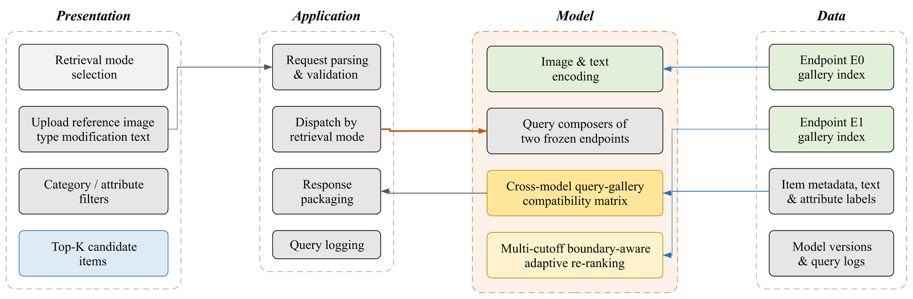
<br/><sub>Four layers, one inference path. The model layer is the only place CrossPath lives —
swap the two endpoint checkpoints and nothing above or below it changes.</sub>
</div>

<br/>

<table>
<tr>
<td width="50%" align="center">
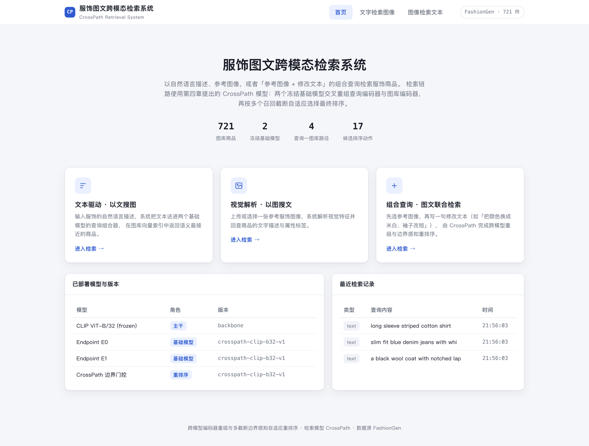
<br/><sub><b>Home.</b> Three entry points — text, image, and combined query —
plus the models actually deployed and a live feed of recent queries.</sub>
</td>
<td width="50%" align="center">
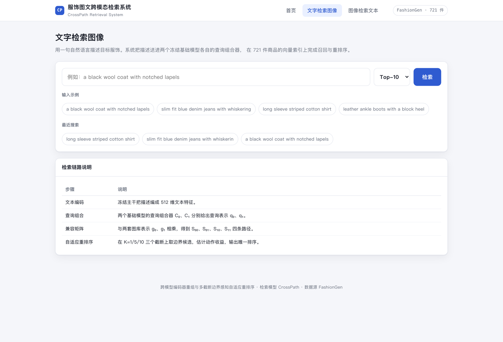
<br/><sub><b>Text → image.</b> A natural-language description is routed through both
endpoints' query composers and matched against the shared gallery index.</sub>
</td>
</tr>
<tr>
<td width="50%" align="center">
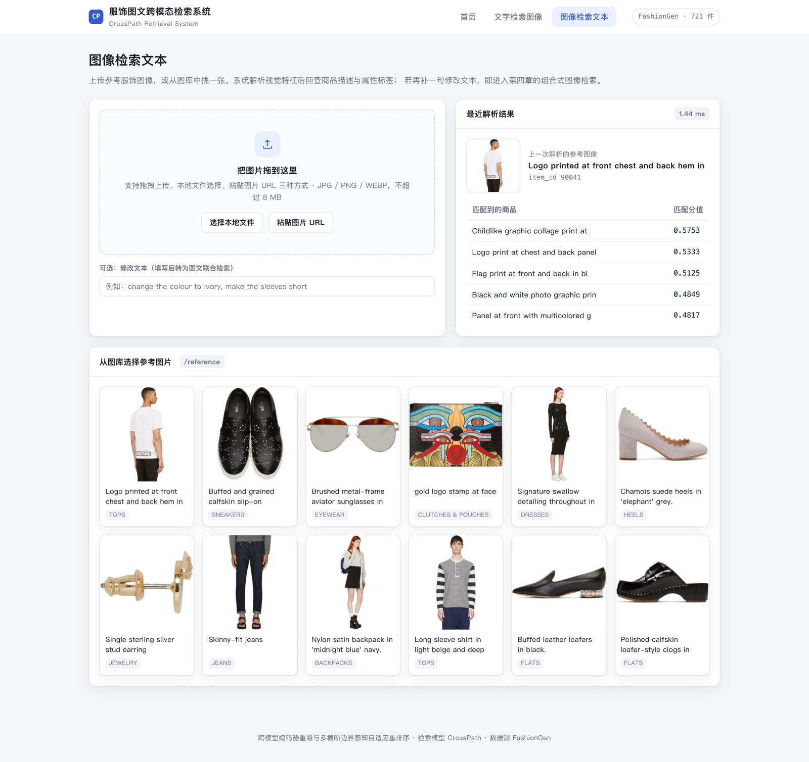
<br/><sub><b>Image → text.</b> Upload a reference photo (or pick one from the gallery) to
recover its description and attributes; add a modification sentence and it becomes a
composed query.</sub>
</td>
<td width="50%" align="center">
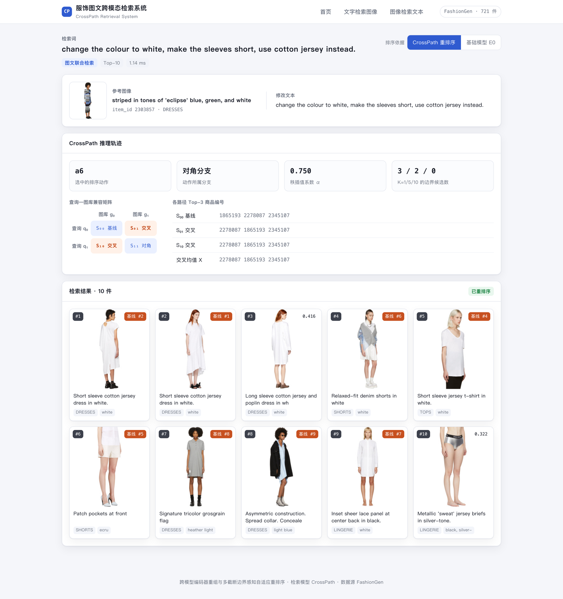
<br/><sub><b>Results.</b> Every field on this page is measured, not decorative: which of the
17 actions fired, which branch it came from, α, the boundary-candidate count per cutoff, and
each item's rank before re-ranking.</sub>
</td>
</tr>
</table>

The full 721-item gallery is built from real annotation files, but those FashionGen-derived images
are licensed and are not redistributed in this public repo (see `.gitignore`); with access to the
internal manifest they came from, `db/build_db.py` builds the real catalog automatically. Without it
— i.e. for anyone who has only cloned this repo — the same script falls back to a small catalog of
15 hand-drawn, unlicensed placeholder garments (`system/data/demo_placeholder/`) so the one-command
setup above always ends with a working, searchable demo rather than an empty gallery. Full setup, the
six functional test cases, and instructions for swapping in real ProCIR/DQU-CIR/MCoT-MVS checkpoints
instead of the CLIP-based demo endpoints are in [`system/README.md`](system/README.md).

---

## 7. Visualizations

<div align="center">

**Directional query–gallery compatibility on FashionIQ.** Rows are query encoders, columns are gallery
encoders. The strongest cell — MCoT query paired with a DQU gallery, 63.99 R@10 — sits **off the diagonal**,
above MCoT's own 63.56. Swapping the direction is weaker, which is why the two cross paths are averaged.

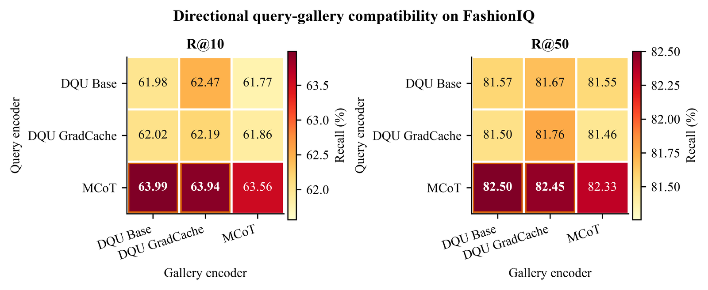

**Rank paths for three real queries.** As the interpolation coefficient α moves the ranking from the
baseline path toward the cross path, the target climbs. The diamond is the action the router actually
picked. Each query crosses its own top-K boundary at a different α — which is why the choice is made
per query rather than once for the whole benchmark.

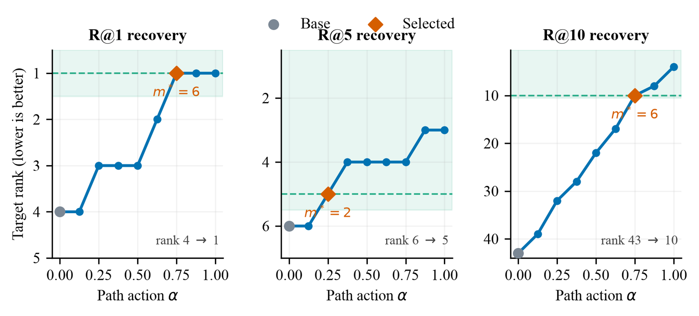

**Retrieval cases on FashionGen** — base endpoint on top, CrossPath below, target in green.

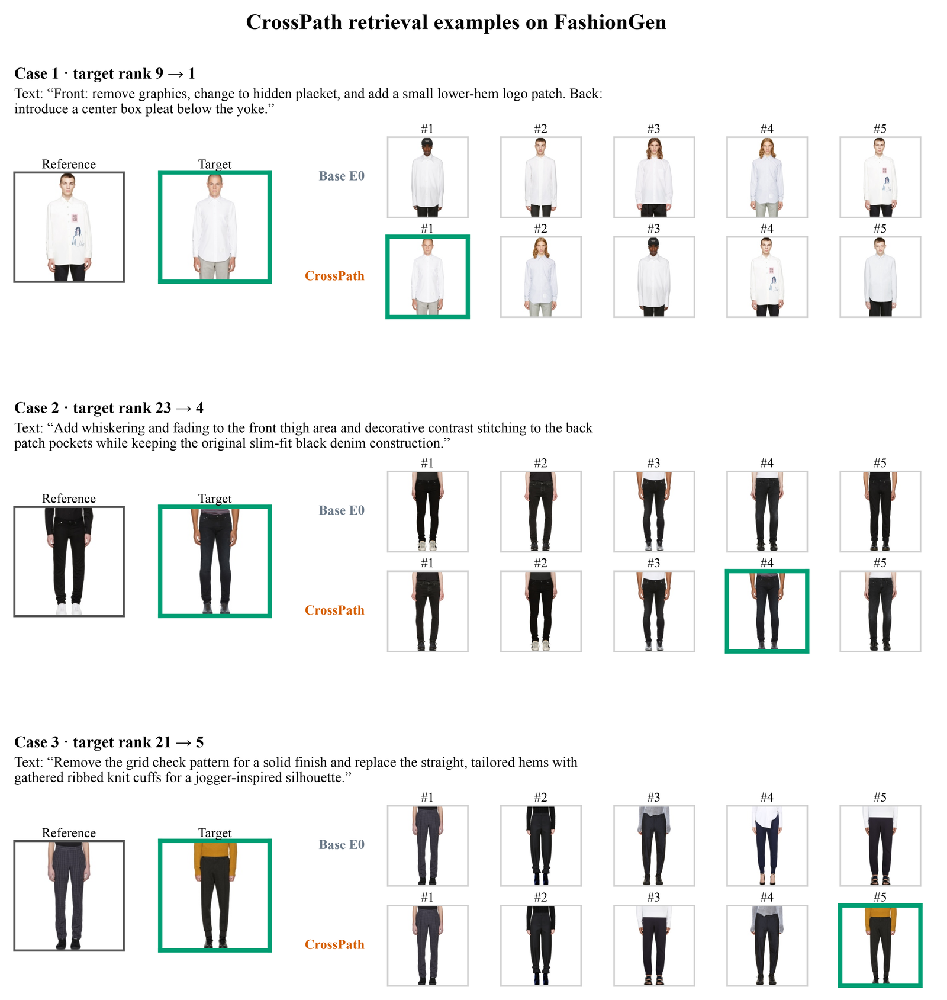

**Retrieval cases on FashionIQ**

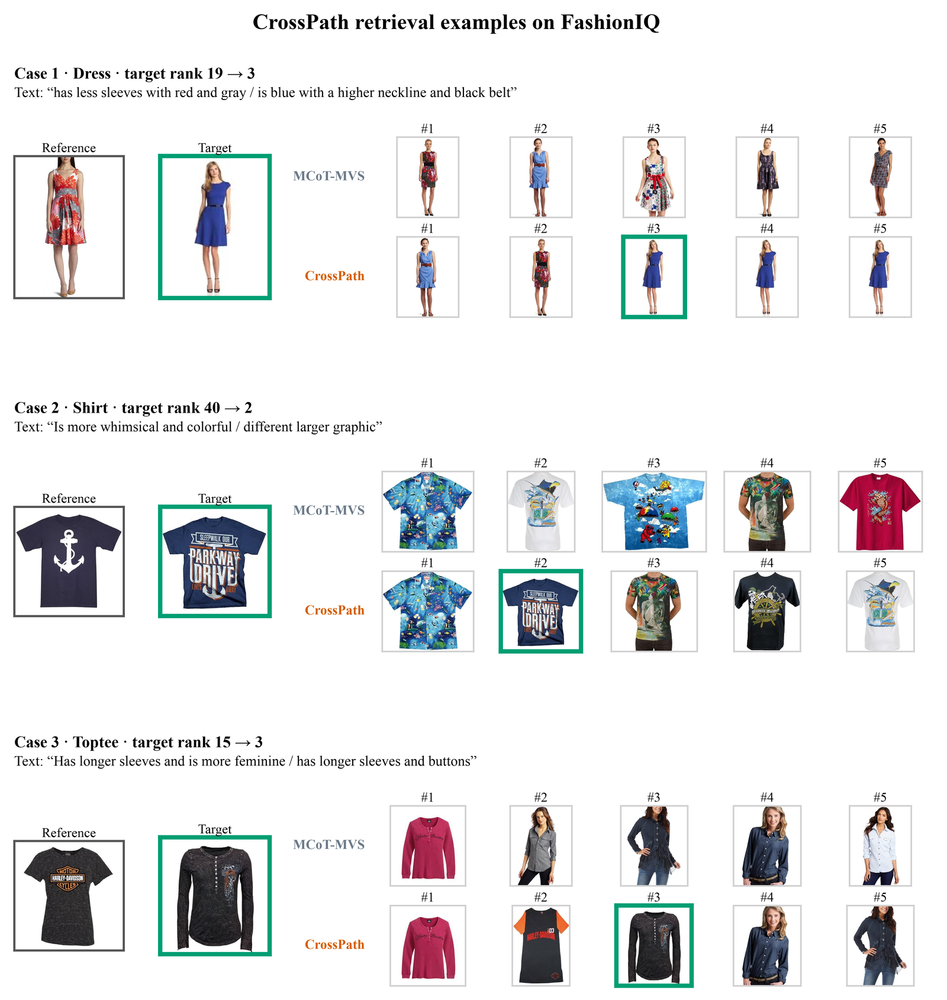

**Module ablation**

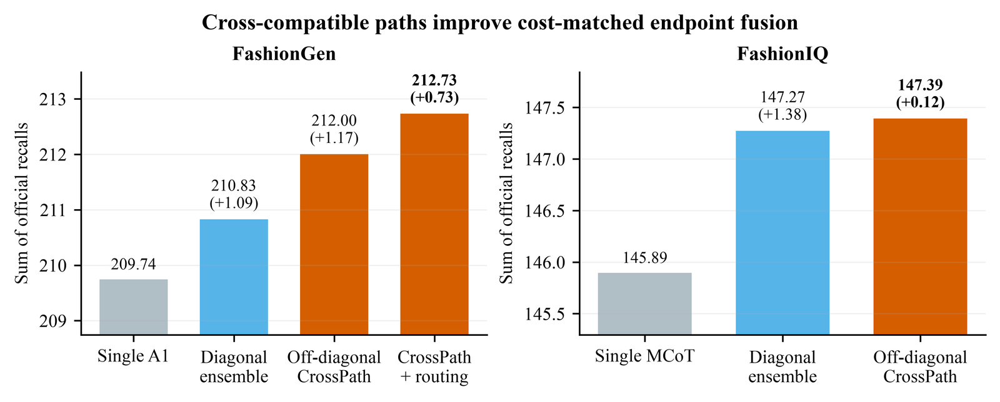

</div>

---

## 8. Repository map

```
weave_crosspath.py              rank paths, boundary traces, utilities, exact fallback
weave_crosspath_gate.py         listwise responsibility scorer and losses
weave_build_crosspath_cache.py  matched / cross / joint path caches
weave_train_crosspath_gate.py   router training and threshold calibration
weave_eval_crosspath_gate.py    frozen single-shot benchmark evaluation
weave_extract_crosspath_*.py    endpoint embedding export (ProCIR, DQU-CIR, MCoT-MVS)
scripts/                        experiment orchestration + zero-parameter evaluators
results/                        frozen JSON manifests and NPZ evaluation artifacts
paper_assets/                   main-table CSVs, case manifests, editable figures
system/                         the Flask demo application
figures/                        figure generators (matplotlib + declarative YAML)
experiment.md                   append-only E0–E32 log, including what failed
test_weave_*.py                 method and protocol regression tests
```

---

## 9. Citation

```bibtex
@misc{liu2026crosspath,
  title        = {CrossPath: Retrieval Ability Hidden Between Two Trained
                  Composed-Image-Retrieval Models},
  author       = {Liu, Zhao},
  year         = {2026},
  howpublished = {\url{https://github.com/ChizkiyahuOhayon/CrossPath}}
}
```

## Upstream projects

- [FashionMV / ProCIR](https://github.com/yuandaxia2001/FashionMV)
- [DQU-CIR](https://github.com/iLearn-Lab/SIGIR24-DQU-CIR)
- [MCoT-MVS](https://arxiv.org/abs/2603.17360)
- [FashionIQ](https://github.com/XiaoxiaoGuo/fashion-iq)

Released under the [MIT License](LICENSE). Datasets and third-party checkpoints keep their own terms.
